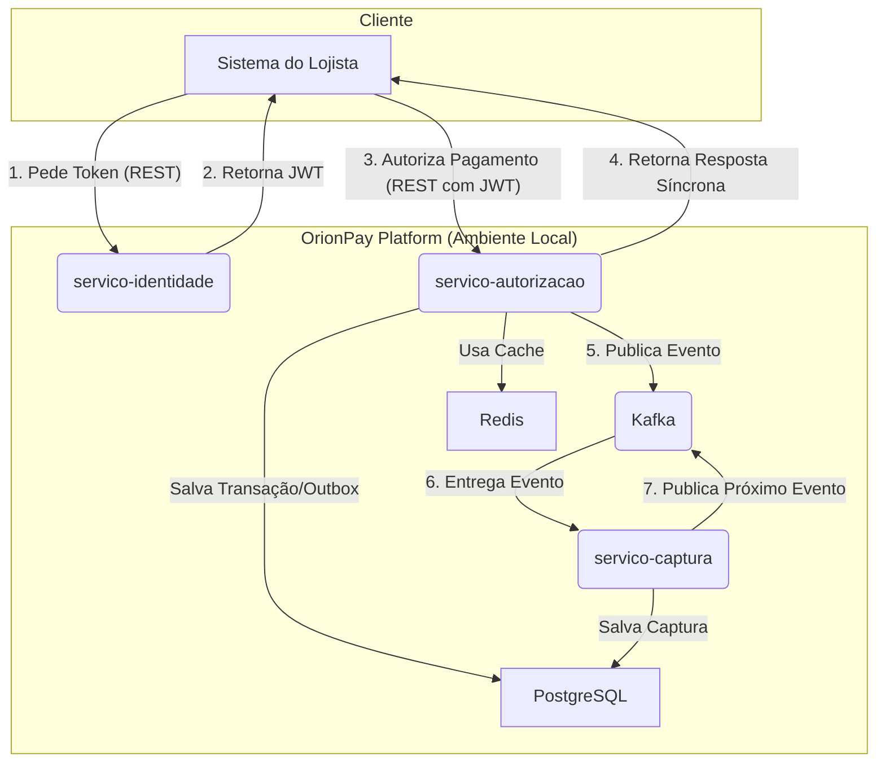

# **OrionPay - Ecossistema de Processamento de Pagamentos**

**OrionPay** é um projeto de simulação de um ecossistema de processamento de pagamentos, construído com uma arquitetura moderna de microserviços. O projeto foi desenvolvido para ser um estudo de caso prático sobre a criação de sistemas distribuídos, resilientes, seguros e escaláveis, utilizando as melhores práticas do mercado para aplicações financeiras.

## 🏛️ Arquitetura

A plataforma utiliza uma **arquitetura de microserviços** para garantir o desacoplamento e a escalabilidade de cada componente de negócio. Cada serviço é construído sobre a **Arquitetura Hexagonal (Ports & Adapters)**, isolando a lógica de negócio das tecnologias de infraestrutura.



## 🚀 Tecnologias Utilizadas

| Categoria | Tecnologia | Propósito |
| :--- | :--- | :--- |
| **Backend** | Java 21, Spring Boot 3 | Framework principal da aplicação |
| **Segurança** | Spring Security, Spring Authorization Server | Autenticação e autorização com OAuth2 e JWT |
| **Persistência** | Spring Data JPA, Hibernate, PostgreSQL | Armazenamento de dados transacionais |
| **Mensageria** | Spring for Kafka, Apache Kafka | Comunicação assíncrona e orientada a eventos |
| **Cache** | Spring Cache, Redis | Cache distribuído para otimização de performance |
| **Resiliência** | Resilience4j | Aplicação de padrões como Circuit Breaker e Retry |
| **Infraestrutura** | Docker, Docker Compose | Containerização e orquestração do ambiente de desenvolvimento |
| **Utilitários** | Lombok, MapStruct, Micrometer | Redução de boilerplate e observabilidade |

## ⚙️ Como Executar o Ambiente

Este projeto é totalmente containerizado, facilitando a execução do ecossistema completo com um único comando.

### Pré-requisitos

  * **Docker** e **Docker Compose**
  * **Java JDK 21** (ou superior)
  * **Apache Maven**

### Iniciando o Ambiente

1.  Clone os repositórios de todos os serviços (`service-identity`, `orionpay-authorization-service`, `service-capture`) para uma pasta raiz.

2.  Certifique-se de que o arquivo `docker-compose.yml` principal esteja nesta mesma pasta raiz.

3.  Abra um terminal na pasta raiz e execute o seguinte comando:

    ```bash
    docker-compose up --build
    ```

    Este comando irá construir as imagens Docker de cada serviço e iniciar todos os contêineres (aplicações, bancos de dados, Kafka, etc.). Aguarde até que todos os serviços estejam saudáveis.

## ⚡ Testando o Fluxo End-to-End

Após iniciar o ambiente, você pode simular uma transação completa usando um cliente de API como o Postman ou `cURL`.

#### Passo 1: Obter o Token de Acesso

Primeiro, peça um token de acesso ao `servico-identidade`.

```bash
curl --location 'http://localhost:9090/oauth2/token' \
--header 'Content-Type: application/x-www-form-urlencoded' \
--user 'orionpay-merchant-client:secret' \
--data-urlencode 'grant_type=client_credentials' \
--data-urlencode 'scope=payments.authorize'
```

Copie o valor do `"access_token"` da resposta.

#### Passo 2: Enviar um Pagamento para Autorização

Agora, use o token obtido para fazer uma chamada ao `servico-autorizacao`.

```bash
# Cole o token copiado na variável abaixo
TOKEN="<SEU_TOKEN_AQUI>"

# Gere uma chave de idempotência única
IDEMPOTENCY_KEY=$(uuidgen)

curl --location 'http://localhost:8080/v1/payments' \
--header "Authorization: Bearer $TOKEN" \
--header "Idempotency-Key: $IDEMPOTENCY_KEY" \
--header 'Content-Type: application/json' \
--data '{
    "amount": 100.50,
    "currency": "BRL",
    "card": {
        "holder_name": "NOME DO CLIENTE",
        "number": "4111222233334444",
        "expiry_month": 12,
        "expiry_year": 2028,
        "cvv": "123"
    },
    "customer": {
        "id": "cust_abc123",
        "email": "cliente@email.com"
    }
}'
```

Se tudo estiver correto, você receberá uma resposta `HTTP 201 Created` e poderá observar nos logs do `service-capture` que o evento foi consumido e processado.

## 🗺️ Visão Geral dos Serviços

| Serviço | Porta Exposta | Responsabilidade Principal |
| :--- | :--- | :--- |
| **`service-identity`** | `9090` | Servidor de Autorização OAuth2, responsável por emitir tokens JWT. |
| **`orionpay-authorization-service`** | `8080` | Processamento síncrono de pagamentos, validação de regras e publicação de eventos. |
| **`service-capture`** | `8082` | Processamento assíncrono de capturas via Kafka, com gestão de falhas e DLQ. |

## 🛣️ Roadmap Futuro

  * [ ] **`servico-liquidacao`**: Para conciliação e liquidação financeira.
  * [ ] **`servico-antifraude`**: Para análise de risco em tempo real.
  * [ ] **`servico-notificacao`**: Para envio de webhooks aos lojistas.
  * [ ] **API Gateway**: Implementar um ponto de entrada único para o ecossistema.
  * [ ] **Pipeline de CI/CD**: Automatizar o build, teste e deploy em um ambiente Kubernetes.

-----

**Autor:** Francisco Araujo
**Licença:** MIT
